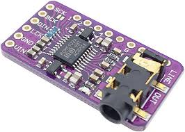
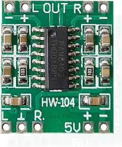
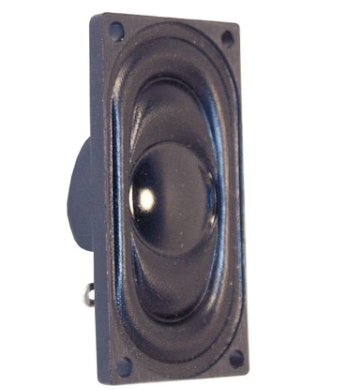
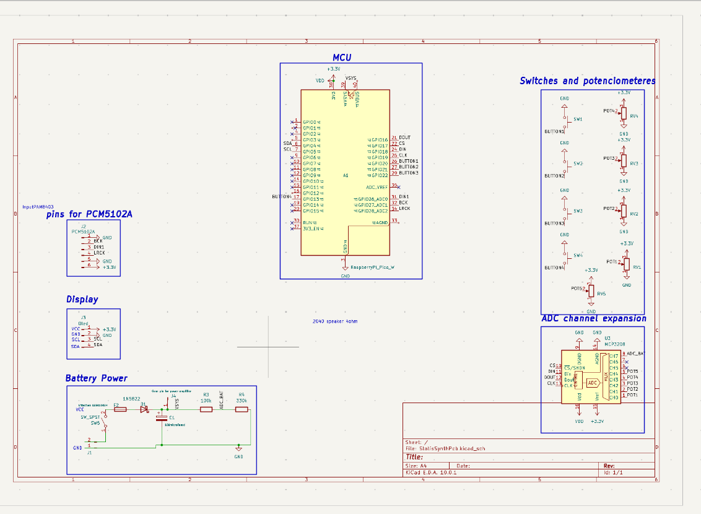
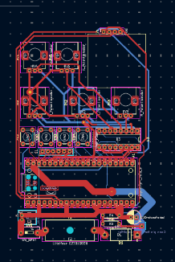

# DYI digital synthesiser
## What is it?
It is a digital synthesizer fully made by me. It has 4 buttons and 5 controllable analog knobs to change settings. It can produce polyphonic sound and can connect to midi. It has settings like frequency, detune, volume, filters, chorus, delay, lfo, etc. It has two 2 watt speakers to produce sound and fully made by me pcb.

## Why?
I have always liked music, since i was kid i played piano, so i wanted to connect my interest in electronics and music into one project. That is why i  made this synthesizer. It has taught me about digital sound and audio alot.

## Electronics
The project uses custom pcb and some modules. It uses PCM5102 I2S audio module for sound generation and PAM8403 for sound amplifying, before it goes into 2040 8 ohm 2 watt speakers. It uses pico 2 as a microcontroller that does all the calculations etc. The pcb is going to be made by jlcpcb and it is fully opensource. It uses voltage dividers for battery percent readings, diode and a fast fuse for safety protection.

